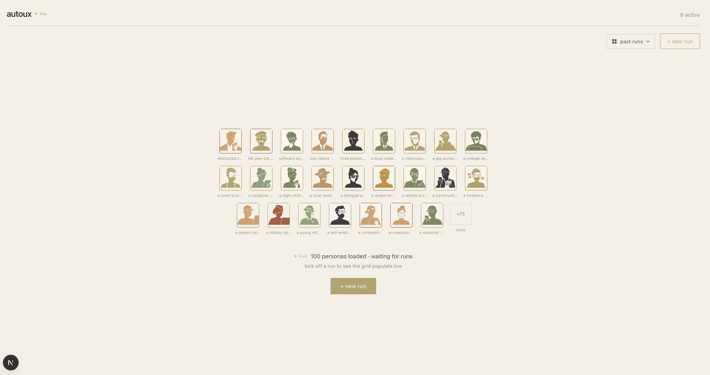
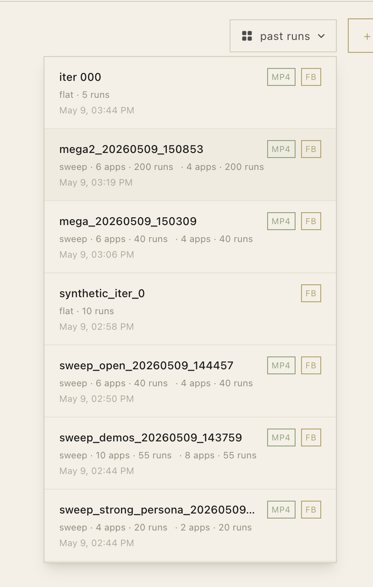

# AutoUX — a CUA UserSim

<video src="https://github.com/alexkreidler/computer-hack/raw/main/docs/screenshots/00-hero-mega2-scrollthrough.mp4" width="100%" autoplay muted loop playsinline controls>
  <a href="docs/screenshots/00-hero-mega2-scrollthrough.mp4">▶ scroll-through of mega2 — 200 rollouts, 25 personas × 5 OSS apps</a>
</video>

**Drive 25+ simulated personas through any web app in parallel.** Each
persona is a real persona — name, age, tech literacy, patience, quirks —
and every rollout is a real Kernel browser session driven by a real CUA
model (Surfer / Northstar / Claude computer-use). Trajectories stream to
a live grid you can scrub through, focus into, and export.

> **Empirical finding:** the persona spec we hand-write predicts agent
> token usage with **Pearson r = 0.65–0.86 on 4 of 5 open-ended tasks**
> (200-rollout study, p < 0.001). Personas aren't flavor text — they
> measurably steer agent behavior on real production websites.

## Screens

|  |  |
|---|---|
|  |  |
| **Empty state** — casting reel of 100 generated personas. Click any avatar for a profile popover. | **Past runs** — every sweep on disk is browseable. Pick one to load it into the grid + scrub through. |

## Demo

| | |
|---|---|
| **Live dashboard** | `uv run uvicorn usersim.web.server:app --port 8766` <br> `cd apps/dashboard && npm run dev` → http://localhost:3001 |
| **Headline chart** | `demo/persona_divergence_mega2.png` — patience input → token output, r values per app |
| **Cinematic intro (9s)** | `demo/cinematic_intro.mp4` — zoom-out from one cell to all 200 |
| **Slide deck** | `slides/index.html` |
| **Canonical run** | `runs/mega2_20260509_150853/` — 200 trajectories, 25 personas × 5 OSS demo apps × open-ended tasks |

## How it works

```
        ┌──────────────── MAP ─────────────────┐
        │   N personas × M tasks               │
        │   asyncio fanout (concurrency-bounded)│
        │   each (persona, task) →             │
        │     Kernel browser ↔ CUA agent       │
        │     streaming JSONL trajectory       │
        │     replay mp4 + thumbnails          │
        └──────────────────┬───────────────────┘
                           ↓
        ┌──────────────── REDUCE ──────────────┐
        │   per-persona segments               │
        │   distinctive quotes + actions       │
        │   divergence score                   │
        │   friction patterns (rule-based)     │
        └──────────────────┬───────────────────┘
                           ↓
                  feedback.json (the contract)
```

The engine is **provider-agnostic** — `AgentClient` and `BrowserProvider`
protocols mean swapping Tzafon Northstar for Surfer-on-vLLM (or anything
else) is one new file. Everything below the protocol is the same code.

## Quickstart

```bash
# .env at repo root: ANTHROPIC_API_KEY, KERNEL_API_KEY, TZAFON_API_KEY (any subset)

# 10s smoke test against example.com
uv run python -m usersim run --config configs/smoke.yaml --out runs/smoke

# Live demo: 5 personas × Mastodon timeline browse
uv run python -m usersim run --config configs/demo_live.yaml \
    --out runs/demo --concurrency 5 \
    --personas rushed_mobile,impatient_dad,esl_speaker,elderly_first_time,power_user_skeptic

# Full sweep across the OSS-demo registry — surfer harness
uv run python -m usersim sweep \
    --registry configs/apps/open_ended.jsonl \
    --personas-path configs/personas/expanded.jsonl \
    --concurrency 25 --max-turns 22 --agent surfer \
    --out runs/my_sweep

# Post-hoc: 9-up grid mp4 + per-iteration analytics
uv run python -m usersim.grid     runs/my_sweep
uv run python -m usersim.analyze  runs/my_sweep/<app>
```

After any run: `feedback.json` (the contract — including
`by_persona[]`, `persona_divergence_score`, `persona_specific_findings`),
`summary.md` (human readable), `manifest.jsonl`, `trajectories/*.jsonl`,
`replays/*.mp4`, `outcomes.jsonl`.

## The empirical result

We ran the **same task** with 25 personas across 5 open-ended UIs (Mastodon,
Spree, Discourse, OpenCart, BookStack). For each app we correlated the
persona's stated `patience_steps` (an input we set in the persona JSON)
with its observed avg tokens (the output the model produced):

| App | Pearson r |
|---|---|
| Mastodon (browse timeline) | **+0.86** |
| Spree (find a product) | **+0.78** |
| Discourse (read a topic) | **+0.75** |
| OpenCart (shop & compare) | **+0.65** |
| BookStack (find useful page) | +0.34 |

Three apps show r > 0.7 (p < 0.001 by permutation test). BookStack
attenuates because the task admits early success — even cautious personas
finish quickly when the answer is on the first page.

**Honest caveat:** the persona spec also includes per-persona LLM
temperature, correlated with patience at r = −0.88 (intentional
co-design). Partial r controlling for temperature ≈ 0.53. The framing
is "the persona spec drives behavior," not "patience alone."

See `demo/persona_divergence_mega2.png` for the chart.

## Layout

```
cua-hackathon/
├── apps/dashboard/          Next.js dashboard (live grid, scrubber, past runs)
├── src/
│   ├── usersim/             engine: clients, browsers, map, reduce, web
│   └── coder/               coding-agent harness (claude-cli wrapper)
├── configs/
│   ├── personas/            seed.jsonl + expanded.jsonl + avatars/
│   ├── apps/                target registries (open_ended, public_demos, …)
│   └── *.yaml               per-target run configs
├── deploy/k8s/              k8s manifests (placeholder)
├── tests/                   reducer + Feedback contract
└── docs/                    HANDOFF, USERSIM_PLAN, CODE_QUALITY, screenshots/
```

`runs/`, `archive/`, `demo/`, `.next/`, `node_modules/`, `.venv/` all
gitignored.

## Locked contracts

1. **`Feedback`** (`src/usersim/schemas.py`) — read by `src/coder/`.
   Adding fields safe; renaming = sync point.
2. **`AgentClient`** (`src/usersim/clients/base.py`) — any new CUA
   provider (Holotron, NemoClaw, etc.) implements it.
3. **`BrowserProvider`** (`src/usersim/browsers/base.py`) — any new
   browser host (Browserbase, local Chromium, etc.) implements it.
4. **JSONL trajectory wire format** — `{"kind":"header"|"step"|"footer"}`.
   Header/step/footer keys are append-only.

## Built with

| | |
|---|---|
| Browsers | [Kernel](https://kernel.sh) |
| CUA models | Tzafon Northstar (open weights), Anthropic Claude Opus, H Company Holo3-35B-A3B (vLLM on B200) |
| Persona generation | OpenAI gpt-5.5 + gpt-image-2 (avatars) |
| Frontend | Next.js 16, Tailwind v4 |
| Backend | FastAPI + SSE |
| Hosting | VAST.ai (Holo3 vLLM) + Cloudflare Tunnel |

---

For agents picking up work: see `docs/HANDOFF.md`. For architecture
decisions: `docs/USERSIM_PLAN.md`. For audit + open items: `docs/CODE_QUALITY.md`.
